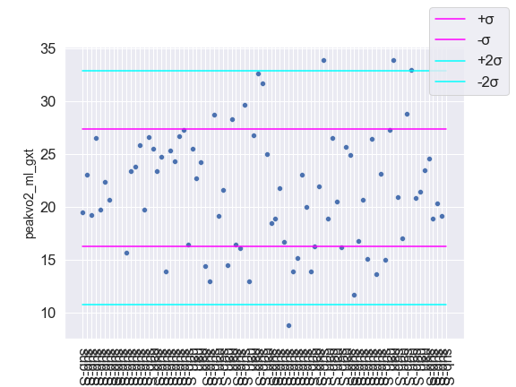
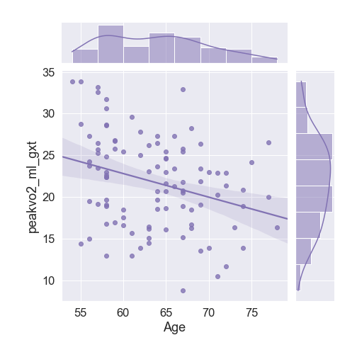
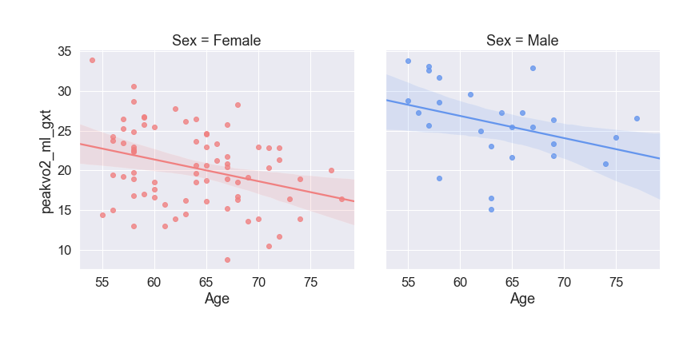
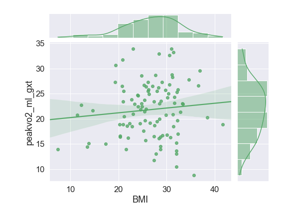
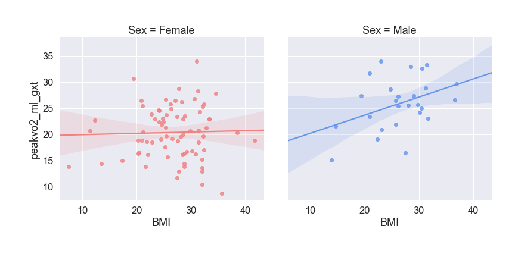

# QCExe - Python3
## Usage
--------------
Place the input data file in the local directory, and change the variable csv_name to the path to the file. Ensure that the data.csv file is in the local directory. After the program is run, the HTML output will automatically open in the default browser.
## Modules
--------------

```
import warnings
warnings.simplefilter(action='ignore', category=FutureWarning) 
```
Warnings is a module used to interact with iPython kernel warnings. The next line is used to suppress warnings to prevent unnecessary output regarding Future warnings from matplotlib in the iPython kernel.

```
import pandas as pd
```
Pandas is the dataframe module used to organize, display, and manipulate large data in a more user-friendly manner than arrays.

```
import seaborn as sns
```
Seaborn is a graphing module that is more suited to handle Pandas dataframes than matplotlib.

```
import os
```
Os is a file-handling module used to browse through the local directory to import images saved as .png’s to the HTML output.

```
import webbrowser
```
Webbrowser is a module that enables Python to open the HTML output in the default browser once the code is run.

```
from scipy import stats as st
```
Stats is a module that provides the linear least-squares regression function st.linregress(x,y), which returns the slope, intercept, r-value, p-value, standard error, and the standard error of the intercept, all as float values.

```
import csv
```
CSV is a module that allows reading of a .csv file.

```
from csv import writer
```
Writer is a module that allows writing to an existing or new .csv file.

```
from sklearn.linear_model import LinearRegression
```
LinearRegression is a module that calculates the linear least-squares regression for a set of data. In this program, it is used to generate predicted values for 3D graph generation, which is not available in the Stats module from SciPy.

```
import numpy as np
```
Numpy is a data analysis module primarily used for arrays and scientific calculations.

```
import matplotlib.pyplot as plt
```
Matplotlib is a graphing module used for basic graphs.

```
from mpl_toolkits.mplot3d import Axes3D
```
Axes3D is a module used to generate 3D graphs.

## Functions
--------------
```
write(var, col, slope, intercept, r_value, p_value, std_err, slope2=-1, intercept2=-1, r_value2=-1, p_value2=-1, std_err2=-1, flag = False)
```
Given variables from the linear regression functions, write to a new or overwrite on an existing .csv file titled with the variable name followed by “_data.csv”. If the inputs correspond to one set of data (the regression did not include Sex), the default values of -1 are used and extra columns are not generated. The r_value is converted to an R^2 value.

```
createGraph(col,AgeSex)
```
Generates three graphs for the given column. The first graph is the column/variable over the subject IDs, with four standard deviation lines (+/-σ and +/-2σ). Afterwards, either the variable over Age and Sex or the variable over BMI and BMI separated by Sex graphs are generated.
```
createBehavioralGraph(col,cols)
```
Generates graphs for the Behavioral data: “peakvo2_ml_gxt", "fft_4step_t1", "fft_4step_t2", "fft_stair_ds_tester1", "fft_stair_us_tester1"
```
create3DGraph(col, r_value1, r_value2, mlr1, mlr2)
```
Generates two 3D graphs, separated by sex, for the variable of interest against BMI and Age. The graphs also display the R^2 value.
```
desc(name)
```
Parses the variable name and returns the corresponding description to be included in the HTML file.
```
mean(name)
```
Returns the mean for the variable, provided by Pandas.
```
median(name)
```
Returns the median for the variable, provided by Pandas.
```
std(name)
```
Returns the standard deviation for the variable, provided by Pandas.
```
rnge(name)
```
Returns the range for the variable by subtracting the minimum value from the maximum value, both provided by Pandas.
```
outliers(name)
```
Checks for subject IDs with values outside of two standard deviations for the variable of interest and appends them to the global map list_outliers.
```
get_outliers()
```
Returns the list of outliers sorted in ascending order by subject ID to be included in the HTML output.
```
get_Data(rows)
```
Returns a table of data formatted in HTML from given array rows to be included in the HTML output. 
```
writeData(var)
```
Reads the .csv file corresponding to the given variable name and generates an array containing each line of the .csv file. If the variable corresponds to Multiple Linear Regression, the rows are filtered out by R^2 values greater than .01. Returns get_Data(rows) to provide the HTML table to be included in the output.

## HTML Output
--------------
* QCGraphs 
* NBS QSI
* NBS RSFC
* Functional Resting-State
* Diffusion QC
* T1 Weighted
* T2 Weighted
* Behavioral Graphs 
    * Peak VO2
    * FourStep 1
    * FourStep 2
    * Stair-Down
    * Stair-Up
* Outliers
* Data
* About
# Example Output
--------------
## Total Data, with +/- 1 and 2 std lines
--------------

## Age
--------------

## Sex
--------------

## BMI
--------------

## BMI Separated by Sex
--------------

## 3D
--------------

=======